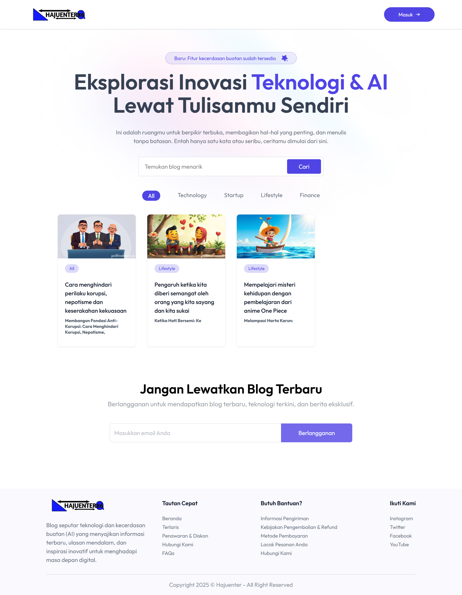
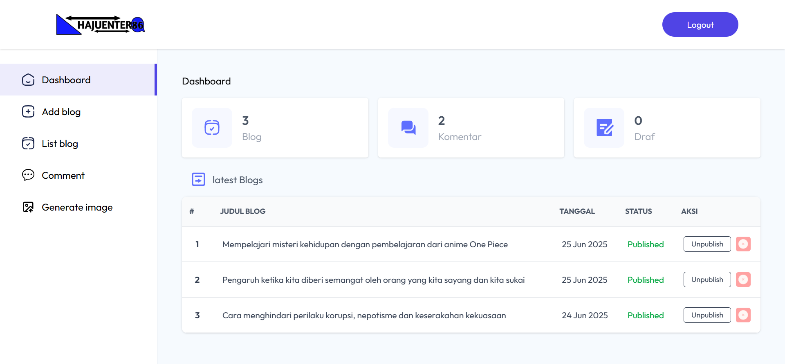
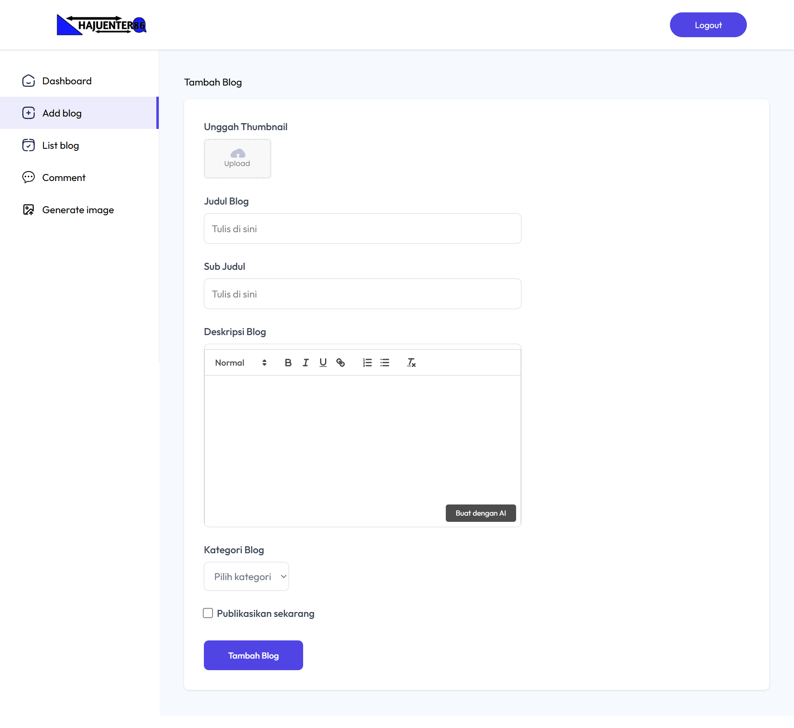
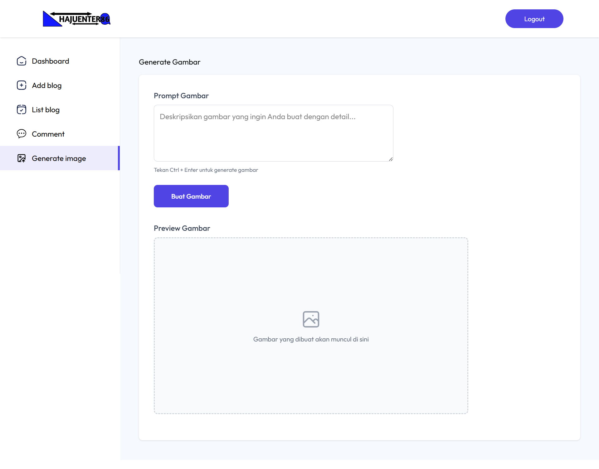

# 📰 Hajuenter Blog

<div align="center">
  <h3>Platform Blog Modern dengan Kecerdasan Buatan</h3>
  <p>
    <strong>Hajuenter Blog</strong> adalah platform blog inovatif yang mengintegrasikan teknologi AI untuk memberikan pengalaman menulis yang lebih cerdas dan efisien. Platform ini membahas berbagai topik terkini mulai dari berita global, teknologi, hingga analisis konflik internasional.
  </p>
</div>

---

## ✨ Fitur Unggulan

### 🤖 **Pembuatan Konten dengan AI**
- **Generator Deskripsi Otomatis**: Masukkan judul blog, lalu sistem akan menghasilkan deskripsi komprehensif menggunakan **Google Gemini 2.5 Flash**
- **Optimasi SEO**: Konten yang dihasilkan sudah dioptimasi untuk mesin pencari
- **Konteks yang Relevan**: AI memahami topik dan menghasilkan konten yang sesuai dengan tema

### 🎨 **Generator Gambar AI**
- **Text-to-Image**: Ubah deskripsi teks menjadi gambar visual yang menarik
- **Powered by Pollinations AI**: Teknologi canggih untuk menghasilkan gambar berkualitas tinggi
- **Penyimpanan Cloud**: Integrasi dengan **ImageKit** untuk manajemen gambar yang optimal
- **Responsive Design**: Gambar otomatis dioptimasi untuk berbagai perangkat

### 📱 **Interface Modern**
- **Responsive Design**: Tampilan yang sempurna di desktop, tablet, dan mobile
- **User Experience**: Interface intuitif dan mudah digunakan
- **Real-time Preview**: Lihat hasil konten sebelum dipublikasikan

---

## 🖼️ Tampilan Website
<div align="center">
🏠 Halaman Utama

<p><em>Tampilan homepage dengan daftar artikel terbaru dan fitur pencarian</em></p>
✍️ Dashboard Admin

<p><em>Panel admin untuk manajemen konten dan analitik website</em></p>
🤖 Fitur AI Content Generator

<p><em>Interface untuk generate konten blog menggunakan AI</em></p>
🎨 AI Image Generator

<p><em>Tool untuk membuat gambar dari deskripsi teks menggunakan AI</em></p>
</div>

---

## 🛠️ Stack Teknologi

### **Frontend**
- ⚛️ **React.js** - Library JavaScript untuk membangun antarmuka pengguna
- ⚡ **Vite** - Build tool modern untuk development yang cepat
- 🎨 **Tailwind CSS** - Styling responsif dan menarik

### **Backend**
- 🚀 **Express.js** - Framework web yang cepat dan minimalis
- 🍃 **MongoDB** - Database NoSQL untuk fleksibilitas data
- 🔐 **JWT Authentication** - Sistem autentikasi yang aman

### **Integrasi AI & Cloud**
- 🧠 **Google Gemini 2.5 Flash** - AI untuk generasi konten blog
- 🎨 **Pollinations AI** - AI untuk generasi gambar dari prompt
- 📸 **ImageKit** - CDN dan manajemen gambar cloud

---

## 🚀 Panduan Instalasi

### **Prasyarat**
- Node.js (versi v22.16.0 atau lebih baru)
- NPM (versi 10.9.2 atau lebih baru)
- MongoDB (lokal atau cloud)
- Git

### **1. Clone Repository**
```bash
git clone https://github.com/hajuenter/blog_app.git
cd blog_app
```

### **2. Setup Backend**
```bash
# Masuk ke direktori server
cd server

# Install dependencies
npm install

# Jalankan server development
npm run dev
```

### **3. Setup Frontend**
```bash
# Buka terminal baru dan masuk ke direktori client
cd client

# Install dependencies
npm install

# Jalankan aplikasi frontend
npm run dev
```

### **4. Konfigurasi Environment Variables**

#### **File `.env` untuk folder `server`**
```env
# DATABASE CONFIGURATION
MONGODB_URL=your_mongo_db_url

# ADMIN CONFIGURATION
ADMIN_EMAIL=your_email
ADMIN_PASSWORD=your_password

# JWT CONFIGURATION
JWT_SECRET=your-super-secure-jwt-secret-key-here

# IMAGEKIT CONFIGURATION
IMAGEKIT_PUBLIC_KEY=your_imagekit_public_key
IMAGEKIT_PRIVATE_KEY=your_imagekit_private_key
IMAGEKIT_URL_ENDPOINT=https://ik.imagekit.io/your_imagekit_id

# GEMINI AI CONFIGURATION
GEMINI_API_KEY=your_gemini_api_key_here
```

#### **File `.env` untuk folder `client`**
```env
# API CONFIGURATION
VITE_BASE_URL=http://localhost:3000
```

### **5. Menjalankan Aplikasi**
Setelah kedua server berjalan:
- **Frontend**: `http://localhost:5173`
- **Backend**: `http://localhost:3000`

---

## 📖 Cara Penggunaan

### **Membuat Blog Post**
1. Login ke dashboard admin
2. Klik "Tambah Blog Baru"
3. Masukkan judul blog
4. Klik "Buat dengan AI" untuk membuat deskripsi otomatis
5. Tambahkan gambar dengan memasukkan prompt untuk AI
6. Review dan publikasikan

### **Generate Gambar**
1. Masukkan deskripsi gambar yang diinginkan (contoh: "sunset over mountains with cyberpunk city")
2. Klik "Buat Gambar"
3. Tunggu beberapa detik hingga gambar terbuat
4. Gambar akan otomatis tersimpan dan siap digunakan

---

## 🔧 Pengembangan Lanjutan

### **Struktur Folder**
```
blog_app/
├── client/                 # Frontend React
│   ├── src/
│   ├── public/
│   └── package.json
├── server/                 # Backend Express
│   ├── aplications/
│   ├── models/
│   ├── routes/
│   ├── middleware/
│   ├── src/
│   └── package.json
└── README.md
```

## 🤝 Kontribusi

Kami sangat mengapresiasi kontribusi dari komunitas! Berikut cara berkontribusi:

1. **Fork** repository ini
2. **Buat branch** untuk fitur baru: `git checkout -b fitur-awesome`
3. **Commit** perubahan: `git commit -m 'Menambahkan fitur awesome'`
4. **Push** ke branch: `git push origin fitur-awesome`
5. **Buat Pull Request** dengan deskripsi yang jelas

### **Panduan Kontribusi**
- Ikuti konvensi kode yang sudah ada
- Tambahkan tests untuk fitur baru
- Update dokumentasi jika diperlukan
- Gunakan commit message yang deskriptif

---

## 📞 Dukungan & Kontak

- **Email**: bahrulahmad1945@gmail.com
- **GitHub Issues**: [Laporkan Bug](https://github.com/hajuenter/blog_app/issues)
- **Dokumentasi**: [Wiki Project](https://github.com/hajuenter/blog_app/wiki)

---

## 📄 Lisensi

Proyek ini dilisensikan di bawah **MIT License**. Silakan gunakan, modifikasi, dan distribusikan sesuai kebutuhan Anda.

```
MIT License

Copyright (c) 2025 Hajuenter

Permission is hereby granted, free of charge, to any person obtaining a copy
of this software and associated documentation files (the "Software"), to deal
in the Software without restriction, including without limitation the rights
to use, copy, modify, merge, publish, distribute, sublicense, and/or sell
copies of the Software.
```

---

<div align="center">
  <p>
    <strong>Dibuat dengan oleh <a href="https://github.com/hajuenter">Hajuenter</a></strong>
  </p>
  <p>
    <em>Mengubah cara kita menulis dengan kekuatan AI</em>
  </p>
</div>